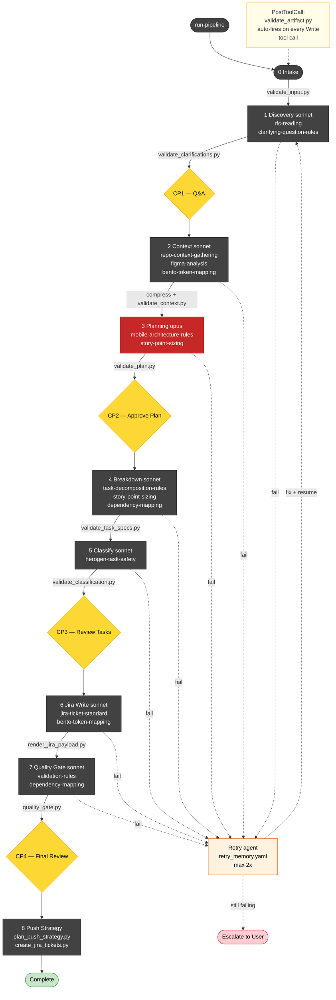

# SprintPlanner

[](https://github.com/hoshiyar-singh8/SprintPlanner/actions/workflows/ci.yml) **v1.4.0**

An AI-powered sprint planning pipeline for Claude Code. Works with **any codebase** — iOS, Android, Web, Backend, Flutter, or anything else. Converts RFC/PRD documents into implementation-ready Jira tickets through 8 automated stages with human checkpoints.

## What it does

```
Codebase → Auto-detect platform → Generate skills (if needed) → RFC → Figma → Plan → Tasks → Jira
```

| Stage | What happens | Output |
|-------|-------------|--------|
| 0. Intake | Ask for codebase (GitHub/local), detect platform, check skills, ask for RFC + Figma | `feature_input.yaml` |
| 1. Discovery | Read RFC, extract requirements, ask clarifying questions | `clarifications.md` |
| 2. Context | Scan repo architecture, Figma designs | `context_pack.yaml` |
| 3. Planning | High-level implementation plan | `high_level_plan.md` |
| 4. Breakdown | Granular single-layer task specs | `task_specs.yaml` |
| 5. Classification | Classify tasks as bot-safe or human-only | `task_specs.yaml` (updated) |
| 6. Jira Writing | Full ticket descriptions + API payloads | `jira_tickets.md` + `jira_payload.json` |
| 7. Quality Gate | Cross-file validation | `validation_report.md` |

### Human Checkpoints

The pipeline pauses at 4 checkpoints for your review:
- **CP1** (after Discovery): Review and answer clarifying questions
- **CP2** (after Planning): Approve the implementation plan
- **CP3** (after Classification): Review task classifications (bot vs human)
- **CP4** (after Quality Gate): Final review of all outputs

### Validation

Every artifact is validated automatically:
- Python validation scripts run between stages
- A PostToolUse hook validates artifacts on every file write
- Failed validation triggers automatic retry (max 2x), then escalates to you

## Installation

### Prerequisites

- [Claude Code](https://claude.ai/code) installed
- Python 3 with PyYAML (`pip3 install pyyaml`)

**Optional MCP servers** (the installer offers to set these up automatically):

| MCP | When needed | What it enables |
|-----|------------|----------------|
| GitHub MCP | Remote repos | Scan GitHub repos without cloning |
| Figma MCP | Design analysis | Extract components, tokens, layouts from Figma |
| Atlassian MCP | Jira integration | Read/create tickets, query sprints, manage boards |

The installer detects missing MCPs and walks you through setup with credential prompts. You can skip any and re-run `./install.sh` later to add them.

### Install

```bash
git clone https://github.com/hoshiyar-singh8/SprintPlanner.git
cd SprintPlanner
./install.sh
```

This copies skills, agents, and hooks into `~/.claude/` and configures the PostToolUse validation hook.

### Uninstall

```bash
./install.sh --uninstall
```

## Usage

Open Claude Code in any project directory and run:

```
/run-pipeline
```

The pipeline will ask you step by step:

1. **"Where's your codebase?"** — GitHub repo URL, local path, or both
2. **Auto-detects your platform** — iOS, Android, Web, Backend, Flutter
3. **Checks for matching skills** — if missing, offers to explore your repo and generate them
4. **"What's the RFC/PRD?"** — file path, URL, or paste content
5. **"Do you have Figma designs?"** — Figma URLs or skip
6. **"Connect to Jira?"** — give a project URL and it auto-discovers components, fields, and priorities via the Jira API
7. Then runs the 8-stage pipeline with checkpoints

### Example

```
/run-pipeline
```

> "Where should I read the codebase from?"
> → `github.com/myorg/my-android-app`
>
> "I detected **Android** (Kotlin + Gradle). Is that correct?"
> → Yes
>
> "I don't have architecture skills for Android yet. (A) Supply your own, or (B) Let me explore?"
> → B
>
> *[explores repo, creates android-architecture-rules, android-context-gathering]*
>
> "What's the RFC?"
> → `docs/feature-rfc.pdf`
>
> "Do you have Figma designs?"
> → `https://figma.com/design/abc123/...`
>
> "Connect to Jira? Give me the project URL and I'll auto-detect everything."
> → `https://myorg.atlassian.net/projects/ANDROID`
> → Epic: `ANDROID-500`
>
> *[auto-discovers components, fields, priorities, sets you as assignee]*

### Resume

If interrupted, run `/run-pipeline` again — it detects `pipeline_state.yaml` and resumes from the last completed stage.

### Supported Platforms

| Platform | Skills shipped? | Auto-generate? |
|----------|----------------|---------------|
| iOS | Yes (VIPER, Bento, UIKit) | N/A |
| Android | No | Yes — explores repo, learns MVVM/Hilt/Compose/etc. |
| Web | No | Yes — explores repo, learns React/Vue/Next/etc. |
| Backend | No | Yes — explores repo, learns Go/Java/Python/etc. |
| Flutter | No | Yes — explores repo, learns BLoC/Riverpod/etc. |

Generated skills are saved to `~/.claude/skills/` and reused across future pipeline runs.

## What's inside

### Skills (14)

| Skill | Purpose |
|-------|---------|
| `run-pipeline` | Entry point — orchestrates the full pipeline |
| `pipeline-artifacts` | YAML/MD schemas for all artifacts |
| `rfc-reading` | RFC reading, requirement extraction, gap identification |
| `clarifying-question-rules` | 6 question categories for thorough discovery |
| `repo-context-gathering` | 3-wave parallel codebase scanning |
| `figma-analysis` | Figma URL parsing and design diff extraction |
| `bento-token-mapping` | Design token verification and mapping |
| `mobile-architecture-rules` | iOS architecture pattern detection |
| `story-point-sizing` | 1/2/3 scale estimation criteria |
| `task-decomposition-rules` | Single-layer task splitting rules |
| `dependency-mapping` | DAG rules and cycle detection |
| `herogen-task-safety` | Bot-safe vs human-only classification |
| `jira-ticket-standard` | Ticket formats and Jira API config |
| `validation-rules` | Per-stage validation requirements |

### Agents (8)

| Agent | Model | Role |
|-------|-------|------|
| `pipeline-orchestrator` | Opus | Manages state, calls stages, handles retries |
| `pipeline-skill-generator` | Opus | Explores unfamiliar repos, generates platform skills |
| `pipeline-discovery` | Sonnet | Reads RFC, produces clarifying questions |
| `pipeline-context` | Sonnet | Scans repo (local or GitHub MCP) and Figma designs |
| `pipeline-planner` | Opus | Creates high-level implementation plan |
| `pipeline-breakdown` | Sonnet | Decomposes plan into task specs |
| `pipeline-classifier` | Sonnet | Classifies tasks as bot/human |
| `pipeline-jira-writer` | Sonnet | Writes Jira ticket descriptions |
| `pipeline-validator` | Sonnet | Cross-checks all artifacts |

### Hooks (13)

| Hook | Trigger |
|------|---------|
| `validate_artifact.py` | PostToolUse (every Write) — routes to correct validator |
| `validate_input.py` | After Stage 0 |
| `validate_clarifications.py` | After Stage 1 |
| `validate_context.py` | After Stage 2 |
| `compress_context.py` | Between Stage 2-3 (trims if >10K chars) |
| `validate_plan.py` | After Stage 3 |
| `validate_task_specs.py` | After Stage 4 |
| `validate_classification.py` | After Stage 5 |
| `render_jira_payload.py` | After Stage 6 (generates Jira API JSON) |
| `jira_auto_config.py` | Stage 0 (auto-discovers Jira project config + sprints via API) |
| `plan_push_strategy.py` | Stage 8 (plans which tickets to push based on strategy) |
| `create_jira_tickets.py` | Stage 8 (pushes tickets to Jira API with filtering + sprint) |
| `quality_gate.py` | After Stage 7 (final cross-file checks) |

## Customization

### Jira Configuration

The pipeline can **auto-configure Jira** during Stage 0 intake. Give it your Jira project URL and it discovers everything via the API:
- Project key, components (mapped by platform), custom fields (story points, sprint, repo)
- Priorities, and sets you as the default assignee

Requires a Jira API token — create one at https://id.atlassian.net/manage-profile/security/api-tokens

You can also set env vars for convenience:
```bash
export JIRA_BASE_URL="https://your-org.atlassian.net"
export JIRA_EMAIL="you@example.com"
export JIRA_API_TOKEN="your-token-here"
```

Or manually edit `~/.claude/jira_config.yaml` (installed from `jira_config.template.yaml`).

### Architecture Rules

Edit `skills/mobile-architecture-rules/SKILL.md` to match your codebase patterns (VIPER, MVVM, etc.).

### Task Splitting Rules

Edit `skills/task-decomposition-rules/SKILL.md` to adjust layer definitions and splitting heuristics.

## Pipeline Architecture



Failed stages retry up to 2x with memory, then escalate to the user.

## Push Tickets to Jira

After the pipeline completes, the orchestrator offers 6 push strategies:

| Strategy | What it does |
|----------|-------------|
| **Full plan** | Push all tickets |
| **Sprint capacity** | Fill up to N SP in dependency order |
| **HeroGen only** | Push bot-safe tickets + their dependencies |
| **Human only** | Push human-required tickets + their dependencies |
| **Cherry-pick** | Push specific task IDs + their dependencies |
| **Skip** | Save for later |

### Manual push

```bash
# Plan a push strategy
python3 ~/.claude/hooks/plan_push_strategy.py .ai/features/my-feature/ --strategy sprint_capacity --capacity 13

# Preview what would be created
python3 ~/.claude/hooks/create_jira_tickets.py .ai/features/my-feature/ --push-plan push_plan.yaml --dry-run

# Create tickets with sprint assignment
python3 ~/.claude/hooks/create_jira_tickets.py .ai/features/my-feature/ --push-plan push_plan.yaml --sprint 42

# Or filter directly without a push plan
python3 ~/.claude/hooks/create_jira_tickets.py .ai/features/my-feature/ --filter herogen --dry-run
```

Requires env vars: `JIRA_BASE_URL`, `JIRA_EMAIL`, `JIRA_API_TOKEN`.

## Testing

Run the test suite:

```bash
cd SprintPlanner
python3 -m unittest discover -s tests -v
```

56 tests cover all validation hooks, the Jira payload renderer, quality gate, and push strategy.

## License

MIT
