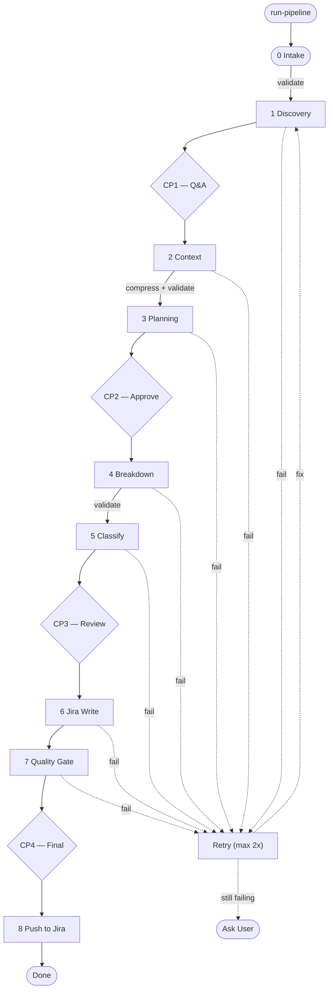

# FeaturePlanner

[](https://github.com/deliveryhero/FeaturePlanner/actions/workflows/ci.yml) **v1.4.1**

A Claude Code pipeline that turns RFCs into Jira tickets. Give it your codebase + an RFC, and it walks through 8 stages — scanning the repo, extracting requirements, breaking down tasks, and generating ready-to-push Jira tickets. Works with any platform (iOS, Android, Web, Backend, Flutter).

## How it works

```
Codebase → Detect platform → Read RFC → Scan repo + Figma → Plan → Break down tasks → Write Jira tickets → Push
```

The pipeline runs 8 stages with **4 human checkpoints** where it pauses for your review:

1. **Intake** — asks for your codebase, RFC, Figma designs, and Jira project
2. **Discovery** — reads the RFC, extracts requirements, asks clarifying questions → **you review & answer**
3. **Context** — scans repo architecture and Figma designs
4. **Planning** — creates a high-level implementation plan → **you approve**
5. **Breakdown** — splits into granular single-layer tasks
6. **Classification** — marks tasks as bot-safe or human-only → **you review**
7. **Jira Writing** — generates full ticket descriptions + API payloads
8. **Quality Gate** — cross-checks everything → **you do final review**, then push to Jira

Every artifact gets validated automatically between stages. Failed validation retries up to 2x, then escalates to you.

## Installation

**Prerequisites:** [Claude Code](https://claude.ai/code) + Python 3 with PyYAML (`pip3 install pyyaml`)

```bash
git clone https://github.com/deliveryhero/FeaturePlanner.git
cd FeaturePlanner
./install.sh
```

This copies 14 skills, 9 agents, and 14 validation hooks into `~/.claude/`. The installer also offers to set up **GitHub**, **Figma**, and **Atlassian** MCP servers — you can skip any and add them later.

### Update

```bash
# Check if an update is available
./install.sh --check

# Pull latest and reinstall
./install.sh --update
```

### Other commands

```bash
./install.sh --setup-mcps   # Set up skipped MCP servers
./install.sh --uninstall     # Remove everything
./install.sh --version       # Show version
```

## Usage

Open Claude Code in any project and run:

```
/run-pipeline
```

It'll ask you step by step:

> "Where's your codebase?" → `github.com/myorg/my-android-app`
>
> "I detected **Android** (Kotlin + Gradle). Is that correct?" → Yes
>
> "I don't have architecture skills for Android yet. Explore your repo and learn?" → Yes
>
> "What's the RFC?" → `docs/feature-rfc.pdf`
>
> "Figma designs?" → `https://figma.com/design/abc123/...`
>
> "Connect to Jira?" → `https://myorg.atlassian.net/projects/ANDROID`, Epic: `ANDROID-500`
>
> *[auto-discovers components, fields, priorities, runs the pipeline]*

If interrupted, run `/run-pipeline` again — it resumes from where it left off.

### Platform support

iOS skills ship out of the box (VIPER, Bento, UIKit). For other platforms (Android, Web, Backend, Flutter), the pipeline explores your repo and generates matching skills automatically. Generated skills are saved to `~/.claude/skills/` and reused.

## Push to Jira

After the pipeline completes, it offers 6 push strategies: full plan, sprint capacity (fill N story points), HeroGen-only, human-only, cherry-pick specific tasks, or skip.

You can also push manually:

```bash
# Preview
python3 ~/.claude/hooks/create_jira_tickets.py .ai/features/my-feature/ --filter herogen --dry-run

# Push with sprint assignment
python3 ~/.claude/hooks/create_jira_tickets.py .ai/features/my-feature/ --push-plan push_plan.yaml --sprint 42
```

Requires env vars: `JIRA_BASE_URL`, `JIRA_EMAIL`, `JIRA_API_TOKEN`.

## Jira Configuration

The pipeline **auto-configures Jira** during intake — give it your project URL and it discovers the project key, components, custom fields, priorities, and sets you as assignee. You can also set env vars or manually edit `~/.claude/jira_config.yaml`.

## Customization

- **Architecture rules** — edit `skills/mobile-architecture-rules/SKILL.md` for your patterns
- **Task splitting** — edit `skills/task-decomposition-rules/SKILL.md` for your heuristics

## Testing

```bash
cd FeaturePlanner
python3 -m unittest discover -s tests -v
```

56 tests covering validators, Jira renderer, quality gate, and push strategy.

## Pipeline diagram



## License

MIT
